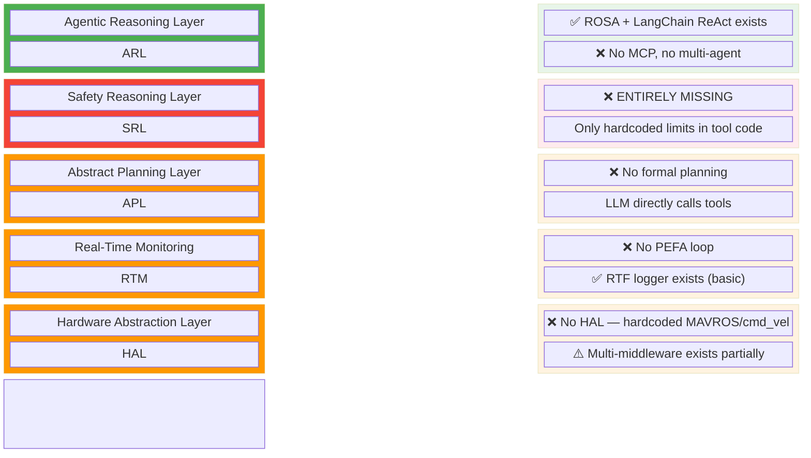
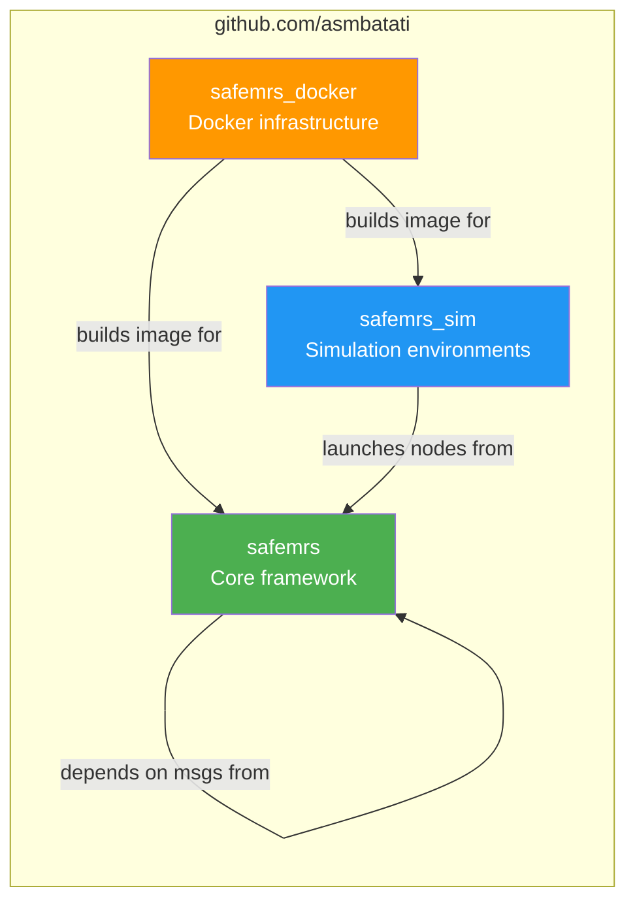

# SAFEMRS — GitHub Implementation Analysis

> **Date**: February 16, 2026  
> **Purpose**: Full audit of the current `ros2_agent_sim` / `ros2_agent_sim_docker` repositories, gap analysis against the SAFEMRS architecture, and a proposed restructuring into clean, purpose-built GitHub repositories.

---

## Table of Contents

1. [Current Repository Audit](#1-current-repository-audit)
2. [Gap Analysis: Current → SAFEMRS](#2-gap-analysis-current--safemrs)
3. [Proposed New Repository Structure](#3-proposed-new-repository-structure)
4. [Docker Architecture](#4-docker-architecture)
5. [Installation & System Requirements](#5-installation--system-requirements)
6. [Phased Implementation Roadmap](#6-phased-implementation-roadmap)
7. [Strengths to Preserve](#7-strengths-to-preserve)

---

## 1. Current Repository Audit

### 1.1 `ros2_agent_sim` — The Simulation + Agent Monorepo

**Location**: `ros2_agent_sim/` — a single ROS 2 workspace containing 6 packages in one repo.

#### Package Breakdown

| # | Package | Type | Lines | Purpose |
|---|---------|------|-------|---------|
| 1 | `ros2_agent` | Python (ament_python) | ~2,300 | Core LLM agent — ROSA + LangChain + Ollama |
| 2 | `simulation_gui` | Python (ament_python) + Vite/React | ~500 + ~230 JSX | Web GUI for drag-drop scenario building |
| 3 | `drone_sim` | Python (ament_python) | ~600 | PX4 SITL launch, MAVROS config, offboard control |
| 4 | `sar_system` | Python (ament_python) | ~608 | SAR mission launcher (Go2 + drone unified) |
| 5 | `sim_evaluation` | Python (ament_python) | ~102 | RTF (Real-Time Factor) performance logger |
| 6 | `gps_bridge` | C++ (ament_cmake) | ~50 | GPS topic relay node |

#### `ros2_agent` — Deep Dive

This is the core intelligence package. Currently structured as:

```
ros2_agent/
├── ros2_agent/
│   ├── __init__.py
│   ├── ros2_agent_node.py        # Main ROS 2 node — 210 lines
│   ├── llm/
│   │   ├── model.py              # ChatOllama init (Qwen3:8b, temp=0.0) — 39 lines
│   │   └── specialist_models.py  # VLM specialist (Qwen2.5VL:7b) — 93 lines
│   ├── prompts/
│   │   └── system_prompts.py     # Hardcoded SAR persona + constraints — 349 lines
│   └── tools/
│       ├── drone_tools.py        # 7 drone tools (926 lines)
│       └── unitree_tools.py      # 8 Go2 tools (760 lines)
├── setup.py
└── package.xml
```

**Key Behavior**:
- `ros2_agent_node.py` auto-discovers robots by scanning ROS topics for `/*/mavros/state` (drones) and `/*/odom` (Go2s)
- Dynamically creates namespaced `DroneTools(node, namespace)` and `UnitreeTools(node, namespace)` instances
- Uses NASA JPL's ROSA framework (wraps LangChain ReAct agent with ROS-awareness)
- Single monolithic agent controls ALL robots — no multi-agent coordination
- CLI interaction via Rich library

**Drone Tools** (via MAVROS):

| Tool | Function | Safety Checks |
|------|----------|---------------|
| `takeoff(altitude)` | Arms, sets OFFBOARD, publishes setpoints | altitude ≤ 20m, altitude > 0 |
| `land()` | Disables setpoints, monitors descent | Ground proximity < 0.2m |
| `get_drone_pose()` | Returns x, y, z + quaternion | None |
| `control_gimbal(pitch, roll, yaw)` | Publishes Float64 to gimbal joints | Angle range checks |
| `camera_feed(action)` | OpenCV window with live gimbal camera | None |
| `go_to_position(x, y, z)` | Updates setpoint target | altitude ≤ 20m |
| `analyze_drone_camera()` | Sends latest frame to Qwen2.5VL:7b | Camera must be active |

**Unitree Go2 Tools** (via Twist/Odometry):

| Tool | Function | Safety Checks |
|------|----------|---------------|
| `go2_move_forward(distance, speed)` | Closed-loop PID with heading correction | distance ≤ 10m, speed ≤ 1.0 |
| `go2_move_to_position(x, y, speed)` | Point-to-point navigation with turn-then-move | speed ≤ 1.0 |
| `go2_stop()` | Emergency stop + cancel navigation | None |
| `get_go2_position()` | Returns x, y, z + yaw from odometry | None |
| `go2_camera_feed(action)` | OpenCV window with Go2's RGB camera | None |
| `go2_test_straight_line(distance, speed)` | Diagnostic movement with detailed logging | None |
| `go2_move_circle(radius, angular_speed, duration)` | Circular motion via v=rω | radius > 0, ω ≤ 1.0 |
| `go2_calibrate_straight()` | Pure forward, no correction — drift analysis | Fixed 3s @ 0.2m/s |

**LLM Configuration**:
- Primary: `ChatOllama("qwen3:8b", temperature=0.0, num_ctx=8192, max_retries=3)`
- Vision: `ChatOllama("qwen2.5vl:7b", temperature=0.0, num_ctx=8192)` — called via `specialist_models.py`
- All local inference via Ollama — no cloud APIs

**System Prompts** (hardcoded in `system_prompts.py`):
- SAR persona with operator interaction guidelines
- Critical instructions emphasizing tool execution over text simulation
- Constraints: drone-Go2 altitude separation, max altitudes, battery awareness
- Command recognition patterns for both robot types
- SAR analysis prompts for VLM camera analysis

#### `simulation_gui` — Deep Dive

```
simulation_gui/
├── simulation_gui/
│   └── gui_node.py      # FastAPI + ROS 2 node — 247 lines
└── web/
    ├── src/
    │   ├── App.jsx       # React drag-drop UI — 232 lines
    │   ├── App.css       # Styling
    │   ├── index.css
    │   └── main.jsx
    ├── tailwind.config.js
    ├── vite.config.js
    └── package.json
```

**Backend** (`gui_node.py`):
- ROS 2 node + FastAPI (uvicorn on `0.0.0.0:8000`) in separate thread
- Single endpoint `POST /launch` — receives placed items JSON, generates a Python launch file to `/tmp/generated_launch.py`, then runs `ros2 launch` on it
- Supports spawning: Go2 (via xacro URDF), drones (PX4 x500 model), persons (Gazebo Fuel), boxes
- Kills previous `ros2 launch` processes before starting new ones

**Frontend** (`App.jsx`):
- Drag-and-drop scene builder with 2D grid canvas
- Available items: Unitree Go2, x500 Drone, Person, Crate, ROSA Agent
- Pixel-to-world coordinate mapping (20m × 20m grid)
- Framer Motion animations, Lucide icons, Tailwind CSS
- Sends `{ items: [...] }` to `/launch` endpoint

**Current limitations**:
- GUI mockup shows 4 robot types (UAV, UGV, Quadruped, Manipulator) and 3 agent types (LLM, VLM, VLA) — only Go2 + drone are actually implemented
- No safety constraint visualization
- No runtime status feedback from simulation

#### `sar_system` — Deep Dive

`sar_system.launch.py` (608 lines) orchestrates the full SAR scenario:

```
Timeline:
  t=0s   → Gazebo Harmonic (default.sdf world)
  t=2s   → ROS-Gazebo bridge (clock, joint_states, tf, Go2 sensors)
  t=4s   → Clock sync validation
  t=5s   → Go2 spawn (URDF via xacro) + TF transforms (map→odom, base_footprint→base_link)
  t=6s   → PX4 SITL (x500_lidar_camera) + XRCE-DDS Agent (port 8888) + MAVROS
  t=8s   → Drone TF transforms (map→drone/odom, base→gimbal, base→lidar, ENU↔NED)
  t=10s  → Drone sensor bridge (camera, lidar, IMU, navsat, gimbal control)
  t=12s  → Go2 controller spawners (joint_states + effort controllers)
  t=20s  → Status checks
```

**Go2 Control Stack**: CHAMP quadruped controller → state estimator → EKF localization (robot_localization) → Gazebo ros2_control

**Drone Control Stack**: PX4 SITL → XRCE-DDS → MAVROS → ROS 2

#### `sim_evaluation` — Deep Dive

`eval_logger.py` (102 lines):
- Subscribes to `/clock`, computes RTF (sim-time / wall-time) over 1-second windows
- Counts robots heuristically by scanning for `/go2_*/scan` and `/drone_*/odom` topics
- Logs to CSV: `[Timestamp, WallTime, SimTime, RobotCount, RTF]`
- Outputs to `~/shared_volume/publications/RSS paper/data/`

---

### 1.2 `ros2_agent_sim_docker` — The Infrastructure Repo

Docker environment targeting Ubuntu 24.04 with:
- ROS 2 Jazzy Desktop
- Gazebo Harmonic (Qt6)
- PX4-Autopilot (SITL)
- XRCE-DDS Agent
- MAVROS
- Ollama + model weights (Qwen3:8b + Qwen2.5VL:7b)
- NASA ROSA + LangChain + Python dependencies
- VS Code, RQt, gedit

**PX4 Aircraft Configs:**

| Config | File | Model |
|--------|------|-------|
| 4020 | `gz_x500_d435` | x500 + Intel RealSense D435 |
| 4021 | `gz_x500_lidar_camera` | x500 + lidar + gimbal camera |
| 4022 | `gz_x3_uav` | x3 UAV |

**Scripts**: `entrypoint.sh`, `install.sh`, `bashrc_template.sh`, `requirements.txt`

**Key issue**: Monolithic Docker image bundles Ollama model weights (~20+ GB), making builds extremely large and slow.

---

## 2. Gap Analysis: Current → SAFEMRS

### 2.1 SAFEMRS Architecture Layers vs. Current Implementation



### 2.2 Detailed Gap Table

| SAFEMRS Component | Sub-Feature | Current State | Gap |
|---|---|---|---|
| **SRL — Formal Verification** | STL/LTL constraint checking | ❌ None | 🔴 Critical |
| **SRL — LLM-as-Judge** | Second LLM reviews plans for safety | ❌ None | 🔴 Critical |
| **SRL — Runtime Monitor** | CBF / conformal prediction guards | ❌ None | 🔴 Critical |
| **SRL — Safety Constraints** | Declarative constraint spec | ⚠️ Hardcoded in tools (altitude ≤ 20m etc.) | 🟡 Partial |
| **SRL — Inter-Robot Safety** | Collision avoidance / separation zones | ⚠️ Mentioned in prompts, not enforced | 🔴 Critical |
| **ARL — ReAct Reasoning** | Multi-step tool calling | ✅ ROSA handles this well | 🟢 Done |
| **ARL — MCP Integration** | External tool protocol | ❌ Tools are Python closures | 🟠 Moderate |
| **ARL — Multi-Agent** | Per-robot sub-agents + meta-coordinator | ❌ Single agent for all robots | 🔴 Critical |
| **APL — Formal Planning** | PDDL / BT / HTN generation | ❌ LLM actions are direct | 🔴 Critical |
| **APL — Multi-Formalism** | Support PDDL, BT, DAG, STL, FSM, Code | ❌ None | 🟠 Future |
| **RTM — PEFA Loop** | Proposal → Execution → Feedback → Adjust | ❌ Tools are fire-and-forget threads | 🔴 Critical |
| **RTM — Re-Planning** | Detect failure, generate new plan | ❌ None | 🔴 Critical |
| **RTM — Perf Metrics** | RTF, safety violations, task completion | ⚠️ RTF only | 🟡 Partial |
| **HAL — Middleware Abstraction** | Unified action interface | ❌ Hardcoded to MAVROS + Twist | 🟠 Moderate |
| **HAL — Robot Resumes** | URDF-derived capability profiles | ❌ Capabilities in prompts text | 🟠 Moderate |
| **HAL — VLA Bridge** | Symbolic plan → motor commands | ❌ None | 🟡 Future |
| **Evaluation** | Safety violation metrics | ❌ None | 🔴 Critical |
| **Evaluation** | Task completion rates | ❌ None | 🟠 Moderate |
| **Evaluation** | Ablation framework | ❌ None | 🟠 Moderate |

### 2.3 Problems with Current Repo Structure

1. **Monorepo coupling**: Agent logic, simulation setup, GUI, evaluation, and infra are tangled in one repo — hard to test, version, or deploy independently
2. **Hardcoded paths**: Launch files reference `/home/user/shared_volume/PX4-Autopilot` — not portable
3. **No safety layer at all**: The core SAFEMRS contribution is completely absent
4. **Single agent bottleneck**: All robots share one LLM instance — no parallelism, no specialization
5. **Fire-and-forget tools**: Movement threads have no completion callbacks — agent doesn't know if actions succeeded
6. **No formal planning**: LLM directly calls tools with zero intermediate representation
7. **Giant Docker image**: Bundling Ollama model weights (~20+ GB) into the Docker image
8. **Dead code**: `drone_status()` tool commented out (150+ lines), unused imports

---

## 3. Proposed New Repository Structure

Replace the two existing repositories with **three** purpose-built repos:

> [!NOTE]
> All repos will initially be hosted under [`github.com/asmbatati`](https://github.com/asmbatati) (private). Once the project is finalized, ownership will be transferred to a new dedicated GitHub organization.



### 3.1 `safemrs` — Core Framework Repository

This is the main research contribution repository. Contains all SAFEMRS-specific code.

```
safemrs/
├── README.md
├── CHANGELOG.md
│
├── safemrs_agent/                     # ROS 2 Package (ament_python)
│   ├── package.xml
│   ├── setup.py
│   ├── safemrs_agent/
│   │   ├── __init__.py
│   │   ├── agent_node.py              # Main agent ROS 2 node (replaces ros2_agent_node.py)
│   │   ├── multi_agent_coordinator.py # Meta-agent for multi-robot task allocation
│   │   │
│   │   ├── reasoning/                 # Agentic Reasoning Layer (ARL)
│   │   │   ├── __init__.py
│   │   │   ├── rosa_backend.py        # ROSA + LangChain integration
│   │   │   ├── mcp_client.py          # MCP protocol client for external tools
│   │   │   └── prompts/
│   │   │       ├── __init__.py
│   │   │       ├── system_prompts.py  # Constraint-aware prompts
│   │   │       └── sar_prompts.py     # SAR-specific scenario prompts
│   │   │
│   │   ├── safety/                    # Safety Reasoning Layer (SRL) ← CORE CONTRIBUTION
│   │   │   ├── __init__.py
│   │   │   ├── safety_gate.py         # Pre-execution pipeline orchestrator
│   │   │   ├── formal_verifier.py     # Channel 1: STL/LTL specification checking
│   │   │   ├── llm_judge.py           # Channel 2: LLM-as-judge safety review
│   │   │   ├── runtime_monitor.py     # Channel 3: Runtime CBF / barrier monitoring (ROS 2 node)
│   │   │   └── constraints/
│   │   │       ├── __init__.py
│   │   │       ├── constraint_parser.py
│   │   │       └── sar_constraints.yaml    # Declarative safety constraints
│   │   │
│   │   ├── planning/                  # Abstract Planning Layer
│   │   │   ├── __init__.py
│   │   │   ├── pddl_planner.py        # PDDL domain/problem generation
│   │   │   ├── plan_validator.py      # Validates plans before execution
│   │   │   └── domains/
│   │   │       └── sar_domain.pddl    # SAR task domain definition
│   │   │
│   │   ├── monitoring/                # Real-Time Monitoring (RTM)
│   │   │   ├── __init__.py
│   │   │   ├── pefa_loop.py           # Proposal-Execution-Feedback-Adjust cycle
│   │   │   ├── execution_tracker.py   # Tracks tool execution state + timeouts
│   │   │   └── replanner.py           # Triggered on failure detection
│   │   │
│   │   └── llm/
│   │       ├── __init__.py
│   │       ├── model_factory.py       # LLM initialization (supports multiple backends)
│   │       └── vision_specialist.py   # VLM integration (Qwen2.5VL etc.)
│   │
│   └── test/
│       ├── test_safety_gate.py
│       ├── test_formal_verifier.py
│       ├── test_llm_judge.py
│       └── test_pefa_loop.py
│
├── safemrs_hal/                       # ROS 2 Package (ament_python) — Hardware Abstraction Layer
│   ├── package.xml
│   ├── setup.py
│   ├── safemrs_hal/
│   │   ├── __init__.py
│   │   ├── hal_interface.py           # Abstract base class for robot actions
│   │   ├── robot_resume.py            # URDF/SDF → capability profile generator
│   │   ├── adapters/
│   │   │   ├── __init__.py
│   │   │   ├── mavros_adapter.py      # Drone control via MAVROS (from drone_tools.py)
│   │   │   ├── twist_adapter.py       # Quadruped/UGV control via cmd_vel (from unitree_tools.py)
│   │   │   ├── grpc_adapter.py        # Future: gRPC-based robots
│   │   │   └── mavlink_adapter.py     # Future: Direct MAVLink
│   │   └── tools/
│   │       ├── __init__.py
│   │       ├── tool_factory.py        # Creates LangChain @tool wrappers from HAL adapters
│   │       ├── drone_tools.py         # Drone tool definitions (uses mavros_adapter)
│   │       └── quadruped_tools.py     # Go2 tool definitions (uses twist_adapter)
│   │
│   └── test/
│       ├── test_mavros_adapter.py
│       └── test_twist_adapter.py
│
├── safemrs_evaluation/                # ROS 2 Package (ament_python)
│   ├── package.xml
│   ├── setup.py
│   ├── safemrs_evaluation/
│   │   ├── __init__.py
│   │   ├── eval_logger.py             # Extended: RTF + safety violations + task completion
│   │   ├── scenario_runner.py         # Automated scenario execution for benchmarking
│   │   ├── metrics/
│   │   │   ├── __init__.py
│   │   │   ├── safety_metrics.py      # Violation counts, response times
│   │   │   ├── task_metrics.py        # Completion rate, time-to-completion
│   │   │   └── scalability_metrics.py # RTF vs robot count curves
│   │   └── scenarios/
│   │       ├── sar_basic.yaml         # Simple: 1 drone, 1 Go2, 1 survivor
│   │       ├── sar_multi.yaml         # Multi: 2 drones, 2 Go2s, 3 survivors
│   │       └── sar_stress.yaml        # Stress: 4 drones, 4 Go2s, 10 survivors
│   │
│   └── test/
│       └── test_metrics.py
│
├── safemrs_gui/                       # ROS 2 Package (ament_python)
│   ├── package.xml
│   ├── setup.py
│   ├── safemrs_gui/
│   │   ├── __init__.py
│   │   └── gui_node.py               # FastAPI backend with safety dashboard
│   └── web/                           # React/Vite frontend
│       ├── src/
│       │   ├── App.jsx                # Drag-drop builder + safety constraint overlay
│       │   ├── components/
│       │   │   ├── Canvas.jsx         # 2D/3D placement
│       │   │   ├── SafetyPanel.jsx    # Live safety status display
│       │   │   └── AgentPanel.jsx     # Agent reasoning trace viewer
│       │   └── main.jsx
│       ├── package.json
│       └── vite.config.js
│
├── safemrs_msgs/                      # ROS 2 Package (ament_cmake) — Custom message/service defs
│   ├── package.xml
│   ├── CMakeLists.txt
│   ├── msg/
│   │   ├── SafetyStatus.msg           # { bool safe, string[] violations, float64 risk_score }
│   │   ├── RobotResume.msg            # { string name, string[] capabilities, geometry_msgs/... }
│   │   └── TaskAllocation.msg         # { string task_id, string robot_id, string status }
│   └── srv/
│       ├── VerifyAction.srv           # request: ActionPlan → response: SafetyVerdict
│       └── AllocateTask.srv           # request: TaskSpec → response: RobotAssignment
│
└── docs/
    ├── architecture.md               # SAFEMRS architecture documentation
    ├── safety_specification.md        # How to define safety constraints
    └── api_reference.md
```

### 3.2 `safemrs_sim` — Simulation Repository

All Gazebo worlds, robot models, and launch orchestration. Kept separate so the core framework is simulation-agnostic.

```
safemrs_sim/
├── README.md
│
├── safemrs_bringup/                   # ROS 2 Package — Launch orchestration
│   ├── package.xml
│   ├── setup.py
│   ├── launch/
│   │   ├── sar_full.launch.py         # Full SAR scenario (Go2 + drone)
│   │   ├── drone_only.launch.py       # Drone-only for isolated testing
│   │   ├── go2_only.launch.py         # Go2-only for isolated testing
│   │   └── evaluation.launch.py       # Launch with eval logger + scenario runner
│   ├── config/
│   │   ├── rviz/
│   │   │   └── safemrs.rviz
│   │   └── bridge/
│   │       └── bridge_topics.yaml     # Gazebo ↔ ROS bridge config
│   └── worlds/
│       ├── sar_default.sdf
│       ├── sar_urban.sdf              # Urban disaster scenario
│       └── sar_wilderness.sdf         # Wilderness SAR scenario
│
├── unitree_go2_description/           # ROS 2 Package — Go2 URDF/meshes
│   ├── package.xml
│   ├── urdf/
│   │   └── unitree_go2_robot.xacro
│   └── meshes/
│
├── unitree_go2_sim/                   # ROS 2 Package — Go2 sim config
│   ├── package.xml
│   ├── config/
│   │   ├── joints/joints.yaml
│   │   ├── gait/gait.yaml
│   │   ├── links/links.yaml
│   │   └── ros_control/ros_control.yaml
│   └── launch/
│       └── go2.launch.py
│
├── px4_models/                        # PX4 aircraft configs
│   ├── 4020_gz_x500_d435
│   ├── 4021_gz_x500_lidar_camera
│   └── 4022_gz_x3_uav
│
└── drone_sim/                         # ROS 2 Package — Drone launch/config
    ├── package.xml
    ├── launch/
    │   ├── drone.launch.py
    │   └── mavros.launch.py
    └── mavros/
        ├── drone_px4_config.yaml
        └── drone_px4_pluginlists.yaml
```

### 3.3 `safemrs_docker` — Docker & Infrastructure

```
safemrs_docker/
├── README.md
├── docker-compose.yml                 # Preferred: multi-service compose
│
├── docker/
│   ├── Dockerfile.base                # ROS 2 Jazzy + Gazebo Harmonic + PX4 + system deps
│   ├── Dockerfile.dev                 # Extends base: adds dev tools (VS Code, RQt, etc.)
│   └── .dockerignore
│
├── scripts/
│   ├── docker_run.sh                  # Container launcher
│   ├── entrypoint.sh
│   ├── install.sh                     # Workspace build + model download
│   ├── install_ollama.sh              # ← SEPARATE: Ollama + model weights download
│   └── bashrc_template.sh
│
├── middleware_profiles/
│   └── rtps_udp_profile.xml
│
├── requirements/
│   ├── requirements.txt               # Python deps (langchain, rosa, etc.)
│   └── system_packages.txt            # apt packages
│
└── ci/
    ├── build.yml                      # GitHub Actions CI
    └── test.yml
```

---

## 4. Docker Architecture

### 4.1 Design Principles

1. **Layered images**: Base image (ROS + Gazebo + PX4) is separate from dev tools
2. **Ollama runs on the host** (not inside Docker) — avoids 20+ GB in the Docker image
3. **Model weights are never baked into the image** — downloaded at runtime or mounted
4. **Shared volume** for workspace source, Ollama socket, and PX4

### 4.2 Image Contents

#### `Dockerfile.base` (~8–10 GB)

| Layer | Contents | Size (est.) |
|-------|----------|-------------|
| Base | Ubuntu 24.04 | ~75 MB |
| ROS 2 | Jazzy Desktop (full) | ~2.5 GB |
| Gazebo | Harmonic + ros_gz_bridge + Qt6 | ~1.5 GB |
| PX4 | Autopilot + SITL + build tools + JSBSim | ~2.0 GB |
| MAVROS | MAVROS + XRCE-DDS + dependencies | ~500 MB |
| CHAMP | Quadruped controller + robot_localization | ~200 MB |
| Python | LangChain, ROSA, OpenCV, NumPy, FastAPI, uvicorn | ~500 MB |
| Graphics | Mesa, Qt6 XCB, X11 libs | ~300 MB |
| Dev tools | git, vim, tmux, htop | ~100 MB |

#### `Dockerfile.dev` (extends base, +~500 MB)

| Layer | Contents | Size (est.) |
|-------|----------|-------------|
| VS Code | code-server or VS Code tunnel | ~300 MB |
| RQt | RQt tools + plugins | ~100 MB |
| Debug tools | gdb, valgrind, rqt_tf_tree | ~100 MB |

### 4.3 What Stays OUTSIDE the Docker Image

| Component | Reason | How It's Accessed |
|-----------|--------|-------------------|
| **Ollama server** | 20+ GB with models; updates frequently | Runs on host, container connects via `host.docker.internal:11434` or mounted socket |
| **Qwen3:8b** | ~5 GB model weights | Managed by host Ollama |
| **Qwen2.5VL:7b** | ~5 GB model weights | Managed by host Ollama |
| **Workspace source** | Active development; needs live edits | Mounted via `-v ~/safemrs_ws:/home/user/safemrs_ws` |
| **PX4-Autopilot** | Large repo (~4 GB); rarely changes | Mounted or cloned at build time with `.gitignore` for build artifacts |

### 4.4 docker-compose.yml Design

```yaml
version: "3.8"

services:
  safemrs:
    build:
      context: .
      dockerfile: docker/Dockerfile.base
    container_name: safemrs
    privileged: true
    network_mode: host
    environment:
      - DISPLAY=${DISPLAY}
      - OLLAMA_HOST=host.docker.internal:11434    # Connect to host Ollama
      - ROS_DOMAIN_ID=0
      - IGN_GAZEBO_RESOURCE_PATH=/opt/PX4-Autopilot/Tools/simulation/gz/models
    volumes:
      - /tmp/.X11-unix:/tmp/.X11-unix:rw           # X11 for GUI
      - ${HOME}/safemrs_ws:/home/user/safemrs_ws    # Source code (live mount)
      - ${HOME}/.ollama:/home/user/.ollama:ro       # Ollama models (read-only)
      - /dev/dri:/dev/dri                           # GPU passthrough
    deploy:
      resources:
        reservations:
          devices:
            - capabilities: [gpu]

  # Optional: Run Ollama as a sibling container instead of host
  ollama:
    image: ollama/ollama:latest
    container_name: safemrs_ollama
    ports:
      - "11434:11434"
    volumes:
      - ollama_data:/root/.ollama
    deploy:
      resources:
        reservations:
          devices:
            - capabilities: [gpu]

volumes:
  ollama_data:
```

---

## 5. Installation & System Requirements

### 5.1 Hardware Requirements

| Component | Minimum | Recommended |
|-----------|---------|-------------|
| **CPU** | 8 cores (x86_64) | 12+ cores |
| **RAM** | 16 GB | 32 GB |
| **GPU** | NVIDIA with 8 GB VRAM | NVIDIA with 12+ GB VRAM (for VLM) |
| **Storage** | 60 GB free | 100 GB free |
| **OS** | Ubuntu 22.04 / 24.04 | Ubuntu 24.04 |

### 5.2 Storage Breakdown

| Component | Size | Notes |
|-----------|------|-------|
| Docker image (base) | ~8–10 GB | ROS 2 + Gazebo + PX4 + deps |
| PX4-Autopilot repo | ~4 GB | Cloned at build or mounted |
| Ollama binary | ~1 GB | Installed on host |
| Qwen3:8b model | ~5 GB | Downloaded via `ollama pull` |
| Qwen2.5VL:7b model | ~5 GB | Downloaded via `ollama pull` |
| Gazebo models (Fuel) | ~2 GB | Downloaded on first run |
| ROS 2 workspace (built) | ~1 GB | colcon build artifacts |
| **Total** | **~26–28 GB** | |

### 5.3 Software Prerequisites

| Prerequisite | Version | Installation |
|--------------|---------|--------------|
| Docker Engine | 24.0+ | [docs.docker.com](https://docs.docker.com/engine/install/) |
| Docker Compose | 2.20+ | Included with Docker Desktop |
| NVIDIA Container Toolkit | latest | For GPU passthrough |
| X11 server | Any | For Gazebo/RViz GUI (default on Ubuntu) |
| Git | 2.30+ | `sudo apt install git` |

### 5.4 Installation Process

```bash
# 1. Clone repositories (hosted under asmbatati until org transfer)
git clone https://github.com/asmbatati/safemrs_docker.git
git clone https://github.com/asmbatati/safemrs.git ~/safemrs_ws/src/safemrs
git clone --recursive https://github.com/asmbatati/safemrs_sim.git ~/safemrs_ws/src/safemrs_sim

# 2. Install Ollama on HOST (not inside Docker!)
curl -fsSL https://ollama.ai/install.sh | sh

# 3. Pull LLM models on HOST (~10 GB total download)
ollama pull qwen3:8b
ollama pull qwen2.5vl:7b

# 4. Build and start Docker environment
cd safemrs_docker
docker compose up -d safemrs    # Builds image on first run (~30 min)

# 5. Enter container and build ROS workspace
docker exec -it safemrs bash
cd ~/safemrs_ws
colcon build --symlink-install
source install/setup.bash

# 6. Launch simulation
ros2 launch safemrs_bringup sar_full.launch.py

# 7. In another terminal — start agent
ros2 run safemrs_agent agent_node
```

### 5.5 Network Requirements

| Connection | Purpose | Bandwidth |
|------------|---------|-----------|
| Ollama host ↔ container | LLM inference | Internal (localhost/socket) |
| Gazebo Fuel models | First-run model download | ~2 GB one-time |
| PX4 SITL ↔ MAVROS | Flight control | Internal UDP |
| Web GUI | React frontend | localhost:8000 |

---

## 6. Phased Implementation Roadmap

### Phase 1: Foundation & Safety (Weeks 1–3) — *Paper-Critical*

> **Deliverable**: Triple-channel safety verification — the core IROS contribution.

| # | Task | Priority | Package |
|---|------|----------|---------|
| 1.1 | Create `safemrs_msgs` with `SafetyStatus.msg`, `VerifyAction.srv` | High | `safemrs_msgs` |
| 1.2 | Implement `constraints/sar_constraints.yaml` + parser | High | `safemrs_agent` |
| 1.3 | Implement `formal_verifier.py` (STL/LTL checking) | Critical | `safemrs_agent` |
| 1.4 | Implement `llm_judge.py` (second LLM safety review) | Critical | `safemrs_agent` |
| 1.5 | Implement `runtime_monitor.py` (continuous CBF node) | Critical | `safemrs_agent` |
| 1.6 | Implement `safety_gate.py` (pipeline orchestrator) | Critical | `safemrs_agent` |
| 1.7 | Integrate safety gate into existing ROSA tool-call flow | Critical | `safemrs_agent` |
| 1.8 | Port existing drone/Go2 tools into `safemrs_hal` adapters | High | `safemrs_hal` |

### Phase 2: Planning & Monitoring (Weeks 4–6)

| # | Task | Priority | Package |
|---|------|----------|---------|
| 2.1 | Implement `pddl_planner.py` + SAR domain definition | High | `safemrs_agent` |
| 2.2 | Implement `pefa_loop.py` + `execution_tracker.py` | High | `safemrs_agent` |
| 2.3 | Refactor tools to return execution handles (not fire-and-forget) | High | `safemrs_hal` |
| 2.4 | Implement `replanner.py` — failure detection → new plan | Medium | `safemrs_agent` |
| 2.5 | Implement `multi_agent_coordinator.py` | Medium | `safemrs_agent` |

### Phase 3: Evaluation & Polish (Weeks 7–9)

| # | Task | Priority | Package |
|---|------|----------|---------|
| 3.1 | Extend `eval_logger.py` with safety violation + task metrics | High | `safemrs_evaluation` |
| 3.2 | Create scenario YAML definitions (basic, multi, stress) | High | `safemrs_evaluation` |
| 3.3 | Implement `robot_resume.py` (URDF → capability profile) | Medium | `safemrs_hal` |
| 3.4 | Add safety dashboard to GUI | Medium | `safemrs_gui` |
| 3.5 | Run ablation experiments (with/without each safety channel) | High | `safemrs_evaluation` |

### Phase 4: Advanced Features (Weeks 10+)

| # | Task | Priority | Package |
|---|------|----------|---------|
| 4.1 | MCP protocol integration for external tools | Low | `safemrs_agent` |
| 4.2 | VLA execution bridge | Low | `safemrs_hal` |
| 4.3 | Multi-formalism planning (BT, HTN alongside PDDL) | Low | `safemrs_agent` |
| 4.4 | Conformal prediction for uncertainty quantification | Low | `safemrs_agent` |

---

## 7. Strengths to Preserve

These elements from the current implementation are solid and should be carried forward:

| Strength | Current Location | Carry To |
|----------|------------------|----------|
| ROSA + LangChain ReAct tool-calling | `ros2_agent_node.py` | `safemrs_agent/reasoning/rosa_backend.py` |
| Namespace-isolated multi-robot | `DroneTools(node, ns)`, `UnitreeTools(node, ns)` | `safemrs_hal/adapters/*` |
| Robot auto-discovery by topic scanning | `ros2_agent_node.py` | `safemrs_agent/agent_node.py` |
| VLM specialist pipeline (Qwen2.5VL) | `specialist_models.py` | `safemrs_agent/llm/vision_specialist.py` |
| Closed-loop Go2 control (PID + heading correction) | `unitree_tools.py` | `safemrs_hal/adapters/twist_adapter.py` |
| Dynamic launch file generation from GUI | `gui_node.py` | `safemrs_gui/gui_node.py` |
| RTF performance logging | `eval_logger.py` | `safemrs_evaluation/eval_logger.py` |
| Docker reproducibility | `ros2_agent_sim_docker` | `safemrs_docker` |
| SAR system prompts + command recognition | `system_prompts.py` | `safemrs_agent/reasoning/prompts/` |
| PX4 SITL + MAVROS + XRCE-DDS stack | `sar_system.launch.py` | `safemrs_sim/safemrs_bringup/launch/` |

---

*This document supersedes the analysis in the prior `ros2_agent_sim` README and serves as the migration guide for transitioning to the SAFEMRS architecture.*
