# SAFEMRS: Safe Agentic Framework for Externally-augmented Multi-Robot Systems

> A Novel Architecture for LLM-Based Heterogeneous Multi-Robot Task Planning with Formal Safety Verification, Agentic Reasoning, and Real-Time Monitoring

---

## 1. Motivation and Problem Statement

Heterogeneous multi-robot systems (HMRS) operating in **partially observable environments** face a fundamental tension: they must be flexible enough to interpret complex, ambiguous human commands, yet rigorous enough to guarantee safe execution across multiple robots with different capabilities. Current approaches address parts of this problem in isolation:

- **LLM-based planners** (SMART-LLM, COHERENT, DART-LLM) excel at task decomposition but lack formal safety guarantees.
- **Formal verification methods** (Webster et al., VerifyLLM) ensure correctness but are brittle against natural language ambiguity.
- **Safety frameworks** (SafePlan) screen prompts but do not verify execution-time behavior.
- **No existing framework** combines agentic LLM reasoning, external tool/resource access (MCP), formal logic verification, and real-time monitoring into a unified architecture.

**We propose SAFEMRS** — a unified framework that bridges probabilistic LLM reasoning and rule-based formal verification within an agentic architecture, augmented by external resources and governed by a continuous safety and monitoring layer.

---

## 2. Conceptual Sketch

---

## 3. Architecture Overview

---

## 4. Detailed Component Description

### 4.1 Agentic Reasoning Layer (ARL)

The core intelligence layer receives natural language commands and orchestrates the entire planning pipeline through **agentic LLM reasoning** — an autonomous, multi-step reasoning process where the LLM iteratively plans, calls tools, and refines its output.

| Component                   | Role                                                                                                                                              |
| --------------------------- | ------------------------------------------------------------------------------------------------------------------------------------------------- |
| **LLM Reasoning Engine**    | Parses human intent via Chain-of-Thought (CoT) prompting; decomposes complex missions into structured sub-tasks with dependency annotations       |
| **Workflow Composer**       | Converts decomposed tasks into complex multi-step workflows; handles sequential, parallel, and conditional execution paths across multiple robots |
| **Abstract Planning Layer** | Technology-agnostic planning interface that can emit plans in multiple formalisms (see §4.5)                                                      |

> **Key difference from prior work**: Unlike SMART-LLM or COHERENT which use LLMs as monolithic planners, our ARL operates as an **autonomous agent** that iteratively refines plans through tool calls, safety checks, and external knowledge retrieval — mimicking the agentic loop paradigm.

---

### 4.2 MCP Tools & External Agents

The ARL is connected to external resources via the **Model Context Protocol (MCP)**, enabling:

| Resource Type          | Examples                                                                          |
| ---------------------- | --------------------------------------------------------------------------------- |
| **MCP Tool Servers**   | RESTful APIs, spatial databases, weather services, sensor data streams            |
| **External AI Agents** | Vision models for scene understanding, domain-specific planners, NLP translators  |
| **Knowledge Base**     | Domain ontology, robot capability registry, spatial maps, historical mission data |

> **Novelty**: No existing multi-robot LLM framework integrates MCP-based external tool access. Current systems (MultiBotGPT, AutoHMA-LLM) are closed-loop — they plan using only the LLM's internal knowledge. Our MCP integration enables **grounded, context-aware planning** by pulling real-world data at reasoning time.

---

### 4.3 Safety Reasoning Layer (SRL) — _Core Novelty_

The SRL combines **formal logic verification** with **probabilistic LLM safety reasoning** into a dual-channel verification system that validates every plan before execution:

```mermaid
graph LR
    subgraph Dual_Verification["Dual-Channel Safety Verification"]
        direction TB

        subgraph Formal["Rule-Based Channel"]
            LTL["LTL/CTL Formula<br/>Translation"]
            MC["Model Checking<br/>(State Space Exploration)"]
            Deon["Deontic Logic<br/>(Obligation / Prohibition)"]
            LTL --> MC --> Deon
        end

        subgraph Probabilistic["LLM-Based Channel"]
            SC["Prompt Sanity Check<br/>(Societal → Org → Individual)"]
            INV["Invariant Reasoner<br/>(Pre/Post-conditions)"]
            CONF["Conflict Reasoner<br/>(Resource & Spatial)"]
            SC --> INV --> CONF
        end
    end

    Plan["Candidate Plan"] --> Formal
    Plan --> Probabilistic
    Formal -->|"Formal Verdict"| Merge["Corroborative<br/>Decision"]
    Probabilistic -->|"LLM Verdict"| Merge
    Merge -->|"✅ Safe"| Exec["Execute"]
    Merge -->|"❌ Unsafe"| Reject["Reject / Refine"]

    style Formal fill:#0f3460,color:#fff
    style Probabilistic fill:#e94560,color:#fff
    style Merge fill:#16213e,color:#fff,stroke:#e94560,stroke-width:3px
```

#### 4.3.1 Rule-Based Channel (Formal Verification)

| Component               | Description                                                                                                                                                |
| ----------------------- | ---------------------------------------------------------------------------------------------------------------------------------------------------------- |
| **LTL/CTL Translation** | Converts task specifications into temporal logic formulas capturing ordering, safety, and liveness properties                                              |
| **Model Checking**      | Explores the state space of the multi-robot plan to verify that all temporal properties hold                                                               |
| **Deontic Logic**       | Encodes obligations (what robots _must_ do), prohibitions (what they _must not_ do), and permissions — extending SafePlan's societal/organizational layers |

#### 4.3.2 LLM-Based Channel (Probabilistic Safety Reasoning)

| Component               | Description                                                                                                                                     |
| ----------------------- | ----------------------------------------------------------------------------------------------------------------------------------------------- |
| **Prompt Sanity Check** | Multi-layer CoT screening (inspired by SafePlan) evaluating societal, organizational, and individual safety                                     |
| **Invariant Reasoner**  | Generates and verifies invariants, preconditions, and postconditions for each action in the plan                                                |
| **Conflict Reasoner**   | Detects resource conflicts (two robots needing the same tool), spatial conflicts (collision risk), and temporal conflicts (deadline violations) |

#### 4.3.3 Corroborative Decision Fusion

Both channels produce independent verdicts. A **corroborative fusion** mechanism (inspired by Webster et al.'s multi-faceted V&V) combines them:

- If **both agree safe** → execute
- If **both agree unsafe** → reject with explanation
- If **they disagree** → escalate to human operator with detailed reasoning from both channels

> **Why this matters**: Pure formal verification misses common-sense hazards (e.g., placing a hot object near a child). Pure LLM reasoning hallucinates and lacks guarantees. Our dual-channel approach provides both **coverage** (LLM catches novel risks) and **soundness** (formal logic prevents violations of known constraints).

---

### 4.4 Real-Time Monitoring Layer (RTM)

Unlike existing frameworks that plan once and execute blindly, our RTM provides **closed-loop awareness**:

| Component               | Role                                                                                                                                                                        |
| ----------------------- | --------------------------------------------------------------------------------------------------------------------------------------------------------------------------- |
| **State Aggregator**    | Fuses telemetry from all robots (pose, battery, task progress) with external data (sensor feeds, environmental changes) into a unified world state                          |
| **Anomaly Detector**    | Monitors for execution drift — deviations from planned trajectories, unexpected obstacles, robot failures, or environmental changes                                         |
| **Re-Planning Trigger** | When anomalies exceed thresholds, triggers the Workflow Composer for dynamic re-planning (similar to DEXTER-LLM's online adaptation, but integrated into the full pipeline) |

The RTM feeds live state back to the ARL, enabling the LLM to make **informed decisions** based on current reality rather than stale assumptions.

---

### 4.5 Abstract Planning Layer (Technology-Agnostic)

A critical architectural decision: the planning layer is **abstracted** behind a uniform interface, supporting multiple planning technologies:

| Technology                                      | Strengths                                                            | Use Case in SAFEMRS                                                   |
| ----------------------------------------------- | -------------------------------------------------------------------- | --------------------------------------------------------------------- |
| **PDDL** (Planning Domain Definition Language)  | Mature, well-understood, efficient heuristic solvers (Fast Downward) | Deterministic, fully-specified tasks with clear preconditions/effects |
| **Behavior Trees (BT)**                         | Modular, reactive, easy to compose and modify at runtime             | Tasks requiring real-time reactivity and fallback behaviors           |
| **DAG-based Plans**                             | Explicit dependency modeling, natural parallelism                    | Tasks with complex inter-robot dependencies (as in DART-LLM, LiP-LLM) |
| **Hierarchical Task Networks (HTN / HDDL 2.1)** | Hierarchical decomposition with temporal support                     | Long-horizon missions requiring hierarchical abstraction              |
| **JSON/YAML Workflows**                         | Human-readable, flexible, easy to integrate with MCP tools           | Rapid prototyping, simple coordination tasks, API-driven workflows    |

The Abstract Planning Layer provides a **unified plan representation** that can be:

1. **Generated** by the LLM in any supported formalism
2. **Verified** by the Safety Reasoning Layer
3. **Executed** by the robot fleet
4. **Monitored** by the RTM

---

### 4.6 Multi-Robot System (MRS)

The robot fleet operates in a **partially observable environment**:

| Feature                        | Description                                                                                                       |
| ------------------------------ | ----------------------------------------------------------------------------------------------------------------- |
| **Heterogeneous Capabilities** | Robots have different skills (aerial, ground, manipulation, sensing)                                              |
| **Inter-Robot Communication**  | Robots share observations, coordinate handoffs, and report status through a peer-to-peer mesh                     |
| **Local Autonomy**             | Each robot has a local execution agent that interprets assigned sub-plans and handles low-level control           |
| **External Resource Access**   | Robots may (optionally) query external MCP tools for real-time information (maps, sensor feeds, databases)        |
| **Partial Observability**      | No single robot sees the full environment; the system must reason under uncertainty and fuse partial observations |

---

## 5. End-to-End Workflow

```mermaid
sequenceDiagram
    actor Human
    participant ARL as 🧠 Agentic Reasoning Layer
    participant MCP as 🔌 MCP Tools
    participant SRL as 🛡️ Safety Reasoning Layer
    participant MRS as 🤖 Multi-Robot System
    participant RTM as 📡 Real-Time Monitor

    Human->>ARL: Natural language command
    ARL->>MCP: Retrieve context (maps, capabilities, KB)
    MCP-->>ARL: Augmented context
    ARL->>ARL: CoT decomposition → sub-tasks + dependencies
    ARL->>ARL: Generate candidate plan (PDDL / BT / DAG)

    rect rgb(15, 52, 96)
        Note over ARL,SRL: Dual-Channel Safety Verification
        ARL->>SRL: Submit candidate plan
        SRL->>SRL: Formal Logic Check (LTL model checking)
        SRL->>SRL: LLM Safety CoT (invariants, conflicts)
        SRL-->>ARL: ✅ Verified plan (or ❌ with feedback)
    end

    alt Plan rejected
        ARL->>ARL: Refine plan using SRL feedback
        ARL->>SRL: Re-submit refined plan
    end

    ARL->>MRS: Send verified mission (augmented context)
    MRS->>MRS: Robots execute assigned sub-tasks
    MRS->>MRS: Inter-robot communication & coordination

    loop Continuous Monitoring
        MRS->>RTM: Telemetry & observations
        RTM->>RTM: Anomaly detection
        alt Anomaly detected
            RTM->>ARL: Re-planning trigger
            ARL->>ARL: Dynamic re-planning
            ARL->>SRL: Verify updated plan
            SRL-->>ARL: ✅ / ❌
            ARL->>MRS: Updated mission
        end
        RTM-->>ARL: Live world state
    end

    MRS-->>Human: Mission complete / status report
```

---

## 6. Contrast with Existing Literature

### 6.1 Feature Comparison Matrix

| Feature                        | SMART-LLM | COHERENT | DART-LLM | LaMMA-P | LiP-LLM  | DEXTER-LLM | SafePlan | VerifyLLM | **SAFEMRS (Ours)**       |
| ------------------------------ | --------- | -------- | -------- | ------- | -------- | ---------- | -------- | --------- | ------------------------ |
| **Agentic LLM reasoning**      | ❌        | ❌       | ❌       | ❌      | ❌       | Partial    | ❌       | ❌        | **✅**                   |
| **External tool access (MCP)** | ❌        | ❌       | ❌       | ❌      | ❌       | ❌         | ❌       | ❌        | **✅**                   |
| **Formal logic verification**  | ❌        | ❌       | ❌       | ❌      | ❌       | ❌         | Partial  | ✅ (LTL)  | **✅ (LTL + Deontic)**   |
| **LLM safety reasoning**       | ❌        | ❌       | ❌       | ❌      | ❌       | ❌         | ✅       | ❌        | **✅**                   |
| **Dual safety verification**   | ❌        | ❌       | ❌       | ❌      | ❌       | ❌         | ❌       | ❌        | **✅ (Corroborative)**   |
| **Real-time monitoring**       | ❌        | ❌       | ❌       | ❌      | ❌       | Partial    | ❌       | ❌        | **✅**                   |
| **Dynamic re-planning**        | ❌        | ❌       | ❌       | ❌      | ❌       | ✅         | ❌       | ❌        | **✅**                   |
| **Heterogeneous robots**       | ✅        | ✅       | ✅       | ✅      | ✅       | ✅         | ✅       | ❌        | **✅**                   |
| **Partial observability**      | ❌        | ❌       | ❌       | ❌      | ❌       | ✅         | ❌       | ❌        | **✅**                   |
| **Dependency modeling**        | ❌        | ❌       | ✅ (DAG) | ❌      | ✅ (DAG) | ❌         | ❌       | ❌        | **✅ (Abstract)**        |
| **Multi-formalism planning**   | ❌        | ❌       | ❌       | PDDL    | ❌       | ❌         | ❌       | ❌        | **✅ (PDDL/BT/DAG/HTN)** |
| **Inter-robot communication**  | ❌        | ❌       | ❌       | ❌      | ❌       | ❌         | ❌       | ❌        | **✅**                   |

### 6.2 Positioning Against Key Related Works

#### vs. SMART-LLM / COHERENT (Task Decomposition)

These frameworks use LLMs for task decomposition and allocation but treat the LLM as a **single-shot planner** — the LLM generates a plan and hands it off. SAFEMRS introduces an **agentic loop** where the LLM iteratively refines plans through tool calls, safety verification feedback, and real-time state updates. Additionally, our MCP integration grounds the LLM's reasoning in external knowledge, reducing hallucination.

#### vs. DART-LLM / LiP-LLM (Dependency Modeling)

Both explicitly model task dependencies (DAGs) but are limited to that single formalism. SAFEMRS provides an **abstract planning layer** supporting multiple formalisms, allowing the system to choose the best representation for each mission type. Furthermore, neither includes safety verification or real-time monitoring.

#### vs. LaMMA-P / GMATP-LLM (LLM + Classical Planners)

These combine LLMs with PDDL solvers — a powerful pattern we adopt. However, they verify only plan **syntactic correctness** (PDDL validator) rather than **semantic safety**. SAFEMRS adds a full Safety Reasoning Layer that performs both formal verification (LTL/CTL model checking) and LLM-based safety reasoning (invariants, conflicts, common-sense hazards).

#### vs. SafePlan (Safety)

SafePlan introduces prompt-level safety screening and invariant reasoning — direct inspirations for our SRL. However, SafePlan operates only **pre-execution** and does not monitor runtime behavior. SAFEMRS extends this with: (1) formal logic verification as a complementary channel, (2) corroborative fusion of both verdicts, and (3) real-time monitoring for execution-time safety.

#### vs. VerifyLLM (Formal Verification)

VerifyLLM translates plans to LTL and uses LLM-based sliding window analysis for verification. We adopt this LTL integration but extend it with: (1) deontic logic for obligations/prohibitions, (2) an LLM-based safety channel for common-sense reasoning, and (3) integration into a full agentic planning pipeline rather than a standalone verifier.

#### vs. DEXTER-LLM (Dynamic Re-planning)

DEXTER-LLM is closest to our vision in supporting dynamic online planning with human-in-the-loop. However, it lacks formal safety verification, MCP-based external tool access, and a structured monitoring layer. SAFEMRS provides a more complete architecture by integrating DEXTER-LLM's adaptive planning with formal safety guarantees.

#### vs. AutoHMA-LLM (Hybrid Architecture)

AutoHMA-LLM's cloud/device LLM split is complementary to our architecture — it could serve as the deployment topology for SAFEMRS's distributed agents. However, AutoHMA-LLM does not address safety verification or real-time monitoring.

---

## 7. Key Novel Contributions

> [!IMPORTANT]
> The following are the primary novelties of SAFEMRS that distinguish it from all surveyed works:

### Novelty 1: Dual-Channel Safety Verification (Formal + Probabilistic)

No existing framework combines **rule-based formal verification** (LTL/CTL model checking, deontic logic) with **probabilistic LLM safety reasoning** (CoT invariant checking, conflict detection). The corroborative fusion mechanism provides both soundness (formal guarantees) and coverage (common-sense hazard detection).

### Novelty 2: Agentic Reasoning with MCP-Based External Augmentation

Current multi-robot LLM planners are closed-loop systems operating solely on the LLM's parametric knowledge. SAFEMRS introduces an **agentic reasoning paradigm** where the LLM autonomously calls external tools, retrieves real-world context, and consults domain-specific agents through the **Model Context Protocol (MCP)** — enabling grounded, context-aware mission planning.

### Novelty 3: Real-Time Monitoring with Dynamic Re-Planning Loop

While DEXTER-LLM supports online adaptation, no framework provides a structured **monitoring layer** that continuously fuses robot telemetry with environmental data, detects anomalies, and triggers re-planning through the same verified pipeline. SAFEMRS closes the loop between planning and execution.

### Novelty 4: Abstract Multi-Formalism Planning Layer

Existing works commit to a single planning formalism (PDDL, behavior trees, or DAGs). SAFEMRS introduces an **abstract planning interface** that supports PDDL, Behavior Trees, DAGs, HTN/HDDL, and JSON/YAML workflows behind a unified API — enabling the system to select the optimal formalism per task type.

---

## 8. Research Questions

1. **RQ1**: How does dual-channel safety verification (formal + LLM-based) compare to single-channel approaches in detecting plan hazards across diverse multi-robot scenarios?

2. **RQ2**: Does MCP-based external augmentation reduce LLM hallucination rates and improve task plan correctness in heterogeneous multi-robot systems?

3. **RQ3**: How does real-time monitoring with dynamic re-planning affect mission success rates in partially observable environments compared to static planning approaches?

4. **RQ4**: Can an abstract planning layer supporting multiple formalisms outperform single-formalism systems in terms of generalization across mission types and complexity levels?

---

## 9. Proposed Evaluation Plan

| Dimension              | Method                                                                                            | Metrics                                                                               |
| ---------------------- | ------------------------------------------------------------------------------------------------- | ------------------------------------------------------------------------------------- |
| **Safety**             | Benchmark of safe/unsafe prompts (extending SafePlan's 621-prompt dataset) + injected plan faults | Harmful prompt rejection rate, false positive rate, hazard detection coverage         |
| **Planning Quality**   | MAT-THOR, VirtualHome, custom heterogeneous robot scenarios                                       | Success rate (SR), Goal Condition Recall (GCR), Executability (Exe), Efficiency (Eff) |
| **Dynamic Adaptation** | Scenarios with injected failures, obstacle changes, robot dropouts                                | Re-planning latency, recovery success rate, mission completion under perturbation     |
| **Scalability**        | 2–10 robots, increasing task complexity                                                           | Planning time, communication overhead, success rate vs. robot count                   |
| **Ablation**           | Remove each component (SRL, RTM, MCP, Abstract Planning) independently                            | Contribution of each module to overall performance                                    |

---

## 10. Summary

SAFEMRS addresses seven critical gaps identified in the literature:

| Gap                                   | How SAFEMRS Addresses It                                   |
| ------------------------------------- | ---------------------------------------------------------- |
| No unified safety verification        | Dual-channel (formal + LLM) corroborative verification     |
| Closed-loop LLM planning              | MCP-based external tool/knowledge augmentation             |
| No runtime monitoring                 | Structured RTM with anomaly detection and re-planning      |
| Single planning formalism             | Abstract layer supporting PDDL, BT, DAG, HTN, YAML         |
| Static plan execution                 | Dynamic re-planning triggered by real-time monitoring      |
| Limited partial observability support | Fused observations from multiple robots + external sensors |
| Missing inter-robot communication     | Peer-to-peer robot coordination within the MRS             |

By combining the strengths of agentic LLM reasoning, formal logic verification, external resource augmentation, and continuous monitoring, SAFEMRS provides the most comprehensive architecture for safe, adaptive multi-robot task planning in partially observable environments.
